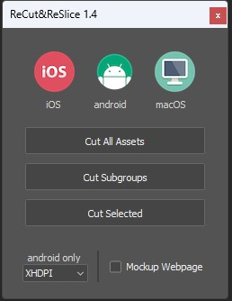

# Recut and ReSlice
A scratchbuilt script that emulates the old Photoshop Extension "Cut and Slice Me" that exported identified layers within a single CS6 Photoshop file. This variation is an ExtendScript file compatible with Photoshop 2020 and 2024.

